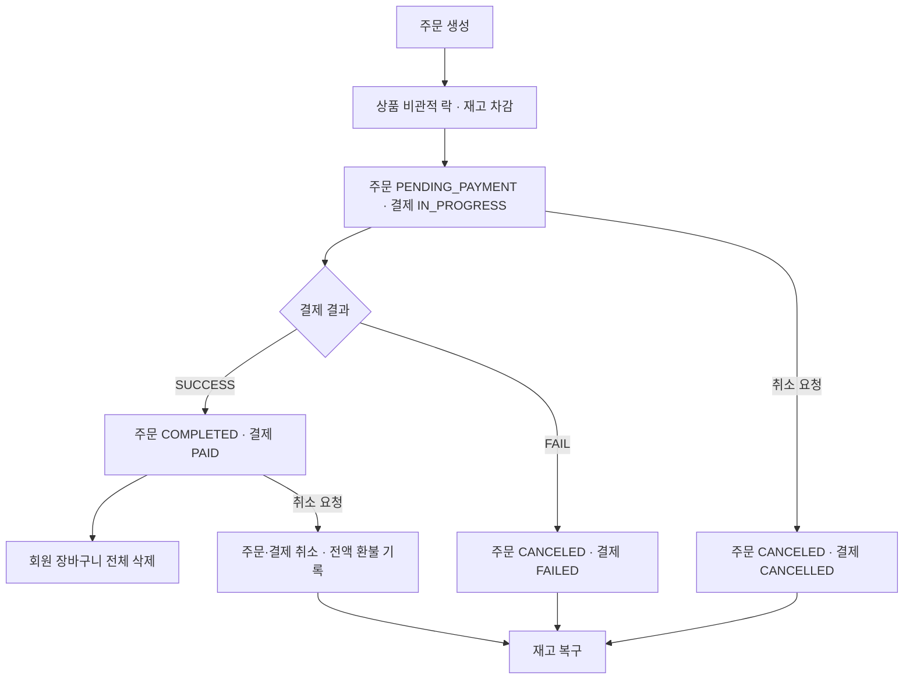

# Commerce Payment System

상품 탐색부터 장바구니, 주문, 결제, 취소·환불까지 구현한 **Spring Boot 기반 커머스 백엔드 API** 프로젝트입니다. 주문 시 재고를 차감하고, 결제 실패 또는 주문 취소 시 재고를 복구하며, 비관적 락을 사용해 동시 요청에 대응합니다.

> 결제는 요청의 `SUCCESS` / `FAIL` 값에 따라 상태를 변경하는 모의 처리입니다. 외부 PG 결제 승인 및 실제 금전 환불 연동은 포함되어 있지 않습니다.

## 주요 기능

| 도메인 | 기능 |
| --- | --- |
| 인증·회원 | 회원가입, BCrypt 비밀번호 암호화, JWT 로그인, 내 정보 조회 |
| 상품 | 목록·상세 조회, 카테고리·가격 필터, 정렬·페이지네이션, 상품 정보 수정 |
| 장바구니 | 상품 추가, 동일 상품 수량 합산, 수량 변경, 개별·전체 삭제 |
| 주문 | 주문서 미리보기, 주문 생성, 내 주문 목록·상세 조회, 재고 차감 |
| 결제 | 주문 생성 시 결제 기록 생성, 금액·소유권·상태 검증, 성공·실패 처리 |
| 취소·환불 | 주문·결제 취소, 재고 복구, 결제 완료 건의 전액 환불 기록 생성 |

상품 목록에는 `ON_SALE`, `SOLD_OUT` 상태의 상품을 노출하고 `DISCONTINUED` 상품은 제외합니다. 주문은 요청에 담긴 상품 목록으로 생성하며, 결제 성공 시 해당 회원의 장바구니 전체를 비웁니다.

## 기술 스택

아래 버전은 저장소 설정 파일 기준입니다.

| 구분 | 기술 |
| --- | --- |
| 언어 | Java 17 |
| 프레임워크 | Spring Boot 4.1.1 |
| 빌드 | Gradle Wrapper 9.7.1 |
| 웹·검증 | Spring Web MVC, Jakarta Validation |
| 데이터 접근 | Spring Data JPA, Querydsl 5.0.0 (Jakarta) |
| 데이터베이스 | MySQL |
| 인증 | Spring Security, JJWT 0.12.6 |
| 개발·테스트 | Lombok, JUnit Jupiter, Spring Boot Test, AssertJ |

Redis Starter 의존성과 Caffeine 설정 항목은 존재하지만, 현재 소스에서 Redis 또는 캐시를 사용하는 비즈니스 로직은 확인되지 않습니다.

## 프로젝트 구조

```text
.
├── build.gradle
├── gradlew / gradlew.bat
├── src/main/java/com/example/commercepaymentsystem2team
│   ├── CommercePaymentSystem2TeamApplication.java
│   ├── common
│   │   ├── config       # Security, JPA Auditing, Querydsl 등
│   │   ├── entity       # 공통 생성·수정 시각
│   │   ├── exception    # 예외 처리 및 에러 코드
│   │   ├── filter       # JWT 인증 필터
│   │   ├── jwt          # 토큰 발급·검증
│   │   └── response     # 공통 응답 모델
│   └── domain
│       ├── auth
│       ├── member
│       ├── product
│       ├── cart
│       ├── order
│       ├── payment
│       └── refund
├── src/main/resources
│   ├── application.yml
│   └── data.sql         # 초기 회원·상품 등 샘플 데이터
└── src/test/java/com/example/commercepaymentsystem2team
    ├── CommercePaymentSystem2TeamApplicationTests.java
    └── OrderConcurrencyTest.java
```

각 도메인은 Controller, Service, Repository, Entity, DTO를 중심으로 구성합니다. 장바구니 추가와 취소·환불은 Facade를 통해 여러 도메인의 처리를 묶습니다.

## 로컬 실행

### 1. 실행 환경 준비

- Java 17과 `JAVA_HOME` 설정
- 로컬 MySQL 서버 및 데이터베이스 생성 권한
- 최초 실행 시 Gradle 배포 파일과 의존성을 내려받을 수 있는 네트워크

MySQL에 접속한 뒤 전용 개발용 데이터베이스를 생성합니다.

```sql
CREATE DATABASE IF NOT EXISTS nbcam
  CHARACTER SET utf8mb4
  COLLATE utf8mb4_unicode_ci;
```

### 2. 환경 설정

기본 연결 대상은 `jdbc:mysql://localhost:3306/nbcam`입니다. 프로젝트 루트에서 환경 변수로 접속 정보를 지정할 수 있습니다.

**Windows PowerShell**

```powershell
$env:SPRING_DATASOURCE_URL = 'jdbc:mysql://localhost:3306/nbcam'
$env:SPRING_DATASOURCE_USERNAME = 'YOUR_DB_USER'
$env:SPRING_DATASOURCE_PASSWORD = 'YOUR_DB_PASSWORD'

# JWT 서명용 무작위 32바이트 키를 Base64로 생성
$jwtKeyBytes = New-Object byte[] 32
[System.Security.Cryptography.RandomNumberGenerator]::Fill($jwtKeyBytes)
$env:JWT_SECRET = [Convert]::ToBase64String($jwtKeyBytes)
```

**macOS / Linux**

```bash
export SPRING_DATASOURCE_URL='jdbc:mysql://localhost:3306/nbcam'
export SPRING_DATASOURCE_USERNAME='YOUR_DB_USER'
export SPRING_DATASOURCE_PASSWORD='YOUR_DB_PASSWORD'
export JWT_SECRET="$(openssl rand -base64 32)"
```

`JWT_SECRET`은 최소 32바이트 키를 Base64로 인코딩한 값이어야 합니다. 기본 토큰 유효기간은 `3600000ms`(1시간)이며 `JWT_EXPIRATION`으로 변경할 수 있습니다.

> 현재 `ddl-auto: create-drop`이므로 애플리케이션 시작 시 스키마를 다시 만들고 종료 시 삭제합니다. `spring.sql.init.mode: always` 설정에 따라 `data.sql`도 실행됩니다. 반드시 데이터가 삭제되어도 되는 개발·테스트 전용 DB를 사용하세요.

### 3. 애플리케이션 실행

Windows:

```powershell
.\gradlew.bat bootRun
```

macOS / Linux:

```bash
chmod +x gradlew
./gradlew bootRun
```

기본 API 주소는 `http://localhost:8080`입니다. 이 저장소는 백엔드 API 소스이며 별도 프런트엔드 화면은 포함하지 않습니다.

## API 목록

인증이 필요한 API에는 다음 헤더를 전달합니다.

```http
Authorization: Bearer <로그인 응답의 token>
```

| 도메인 | 메서드 | 경로 | 설명 | JWT |
| --- | --- | --- | --- | --- |
| 인증 | POST | `/api/auth/signup` | 회원가입 | 불필요 |
| 인증 | POST | `/api/auth/login` | 로그인 | 불필요 |
| 회원 | GET | `/api/members/me` | 내 정보 조회 | 필요 |
| 상품 | GET | `/api/products` | 목록·검색 | 불필요 |
| 상품 | GET | `/api/products/{id}` | 상세 조회 | 불필요 |
| 상품 | PATCH | `/api/products/{id}` | 정보 수정 | 불필요¹ |
| 장바구니 | GET | `/api/cart` | 장바구니 조회 | 필요 |
| 장바구니 | POST | `/api/cart/items` | 상품 추가 | 필요 |
| 장바구니 | PATCH | `/api/cart/items/{id}` | 수량 변경 | 필요 |
| 장바구니 | DELETE | `/api/cart/items/{id}` | 항목 삭제 | 필요 |
| 장바구니 | DELETE | `/api/cart` | 전체 비우기 | 필요 |
| 주문 | POST | `/api/orders/preview` | 주문서 미리보기 | 필요 |
| 주문 | POST | `/api/orders` | 주문 생성 | 필요 |
| 주문 | GET | `/api/orders` | 내 주문 목록 | 필요 |
| 주문 | GET | `/api/orders/{orderId}` | 내 주문 상세 | 필요 |
| 결제 | POST | `/api/payments/confirm` | 모의 결제 결과 처리 | 필요 |
| 결제 | GET | `/api/payments/{orderId}` | 주문의 결제 조회 | 필요 |
| 환불 | POST | `/api/refunds` | 주문 취소·환불 | 필요 |

¹ 현재 `SecurityConfig`는 `/api/products/**` 전체를 공개하므로 상품 수정도 인증 없이 접근 가능합니다. 관리자 전용 권한은 구현되어 있지 않습니다.

장바구니 경로의 `{id}`는 상품 ID가 아닌 **장바구니 항목 ID**입니다.

### 상품 검색 파라미터

| 파라미터 | 기본값 | 설명 |
| --- | --- | --- |
| `page` | `0` | 0부터 시작하는 페이지 |
| `size` | `20` | 페이지 크기 |
| `category` | 없음 | `SMARTPHONE`, `LAPTOP`, `TABLET`, `EARPHONES`, `SMARTWATCH`, `MONITOR` |
| `minPrice` / `maxPrice` | 없음 | 최소·최대 가격, 경계값 포함 |
| `sort` | `LATEST` | `LATEST`, `PRICE_ASC`, `PRICE_DESC` |

```http
GET /api/products?category=SMARTPHONE&minPrice=100000&maxPrice=1000000&sort=PRICE_ASC&page=0&size=20
```

주문 목록은 `page`, `size`, `sort`를 받으며 기본 페이지 크기는 10입니다.

## API 사용 예시

요청 본문은 `Content-Type: application/json`으로 전송합니다. 아래 상품·주문 ID와 금액은 예시이며 실제 조회·생성 결과에 맞게 바꿔야 합니다.

### 1. 회원가입 및 로그인

`POST /api/auth/signup` — 성공 시 `201 Created`, 응답 본문 없음.

```json
{
  "name": "홍길동",
  "email": "demo@example.com",
  "password": "demo-password",
  "phoneNumber": "010-1234-5678"
}
```

`POST /api/auth/login`

```json
{
  "email": "demo@example.com",
  "password": "demo-password"
}
```

로그인 응답의 `token`을 이후 인증 헤더에 사용합니다. 샘플 회원의 평문 비밀번호는 제공된 소스에서 확인되지 않으므로 새로 회원가입해 테스트할 수 있습니다.

### 2. 장바구니 담기

`POST /api/cart/items`

```json
{
  "productId": 1,
  "quantity": 1
}
```

### 3. 주문서 미리보기 및 주문 생성

`POST /api/orders/preview`와 `POST /api/orders`는 같은 본문을 사용합니다. 미리보기는 금액을 계산하고, 주문 생성은 재고를 차감하고 결제 대기 기록을 생성합니다.

```json
{
  "items": [
    { "productId": 1, "quantity": 1 }
  ]
}
```

주문 생성 응답의 `data.orderId`와 `data.totalAmount`를 다음 결제 요청에 사용합니다.

### 4. 모의 결제

`POST /api/payments/confirm`

```json
{
  "orderId": 1,
  "result": "SUCCESS",
  "amount": 899000
}
```

- `SUCCESS`: 결제 `PAID`, 주문 `COMPLETED`, 회원 장바구니 전체 삭제
- `FAIL`: 결제 `FAILED`, 주문 `CANCELED`, 주문 상품 재고 복구
- `amount`가 저장된 결제 금액과 다르면 요청 거절

### 5. 주문 취소·환불

`POST /api/refunds`

```json
{
  "orderId": 1,
  "reason": "단순 변심"
}
```

결제 대기 건은 주문·결제를 취소하고, 결제 완료 건은 전액 환불 기록도 생성합니다. 두 경우 모두 주문 상품의 재고를 복구합니다. 환불 사유는 필수이며 최대 100자입니다.

### 응답 형식

주문·결제·환불 API의 성공 응답은 아래 공통 형식을 사용합니다. `data` 구조는 API마다 다릅니다.

```json
{
  "success": true,
  "code": null,
  "message": null,
  "data": {}
}
```

인증·회원·상품·장바구니 API는 각 DTO를 직접 반환하거나 본문 없이 응답합니다. 모든 API가 동일한 응답 래퍼를 사용하는 것은 아닙니다.

## 주문·결제 처리 흐름



주문 생성은 상품 조회에 `PESSIMISTIC_WRITE` 락을 사용합니다. 주문 취소는 주문을 비관적 락으로 다시 조회한 뒤 취소 상태를 반영하고 재고를 복구합니다. 여러 도메인이 참여하는 결제 처리와 취소·환불은 각각 트랜잭션으로 묶여 있습니다.

## 테스트 및 빌드

프로젝트 루트에서 실행합니다. 테스트도 Spring 컨텍스트와 DB를 사용하므로 개발·테스트 전용 MySQL 연결이 필요합니다.

```powershell
# 전체 테스트
.\gradlew.bat test

# 주문 동시성 테스트만 실행
.\gradlew.bat test --tests '*OrderConcurrencyTest'

# 테스트를 포함한 빌드
.\gradlew.bat build
```

macOS / Linux에서는 `.\gradlew.bat` 대신 `./gradlew`를 사용합니다. 테스트 보고서는 `build/reports/tests/test/index.html`, 실행 JAR는 `build/libs/`에 생성됩니다.

| 테스트 | 검증 내용 |
| --- | --- |
| 애플리케이션 컨텍스트 테스트 | Spring 컨텍스트 로드 |
| 100개 동시 주문 | 재고 10개 기준 성공 주문 수가 10 이하이고 잔여 재고가 `10 - 성공 수`인지 확인 |
| 동일 주문의 100개 동시 취소 | 취소 성공이 1회이고 최종 재고가 10으로 복구되는지 확인 |

동시성 테스트는 회원 ID `1`과 상품명 `스마트폰 X 128GB`를 사용합니다. `@ActiveProfiles("test")`는 선언되어 있으나 별도 `application-test.yml`은 포함되어 있지 않습니다. 테스트 통과 여부는 실제 실행으로 확인해야 하며, 이 README 작성 과정에서는 빌드·테스트를 실행하지 않았습니다.

## 상품 인덱스 성능 측정 기록

아래 수치는 기존 README의 측정 기록을 보존한 것으로, 이번 문서 작성 중 재측정한 결과가 아닙니다. 측정 환경·반복 횟수·전체 요청 조건이 기록되어 있지 않으므로 환경에 관계없는 성능 보장으로 해석하지 않습니다.

### 적용 인덱스

`Product` 엔티티에 다음 복합 인덱스가 선언되어 있습니다.

```sql
CREATE INDEX idx_status_category_price ON product (status, category, price);
CREATE INDEX idx_status_price ON product (status, price);
CREATE INDEX idx_status_created_at ON product (status, created_at);
```

위 DDL은 구조 설명용입니다. JPA가 이미 생성한 인덱스를 중복 생성할 필요는 없습니다.

### SQL 실행 계획 비교

| 구분 | 가격 조건 | type | key | rows | filtered | 기록된 실행시간 |
| --- | --- | --- | --- | ---: | ---: | ---: |
| 인덱스 전 | 10~15만원 | ALL | null | 59,476 | 0.93 | 348ms |
| 인덱스 전 | 0~99만원 | ALL | null | 59,476 | 0.93 | 350ms |
| 인덱스 후 | 10~15만원 | range | idx_status_category_price | 199 | 100 | 352ms |
| 인덱스 후 | 0~99만원 | range | idx_status_category_price | 15,190 | 100 | 351ms |

좁은 가격 조건의 실행 계획상 `rows` 추정치는 59,476에서 199로 약 299분의 1로 줄었습니다. 기록된 SQL 실행시간에는 뚜렷한 개선이 없습니다.

### API 응답시간 비교 — Postman

| 구분 | 가격 조건 | totalElements | 응답시간 |
| --- | --- | ---: | ---: |
| 인덱스 없음 | 10~15만원 | 207 | 38ms |
| 인덱스 없음 | 0~99만원 | 207 | 39ms |
| 인덱스 있음 | 10~15만원 | 207 | 10ms |
| 인덱스 있음 | 0~99만원 | 207 | 25ms |

좁은 조건에서 기록된 API 응답시간은 38ms에서 10ms로 감소했습니다. 두 가격 조건의 `totalElements`가 동일하게 기록되어 있으므로 재현 시 요청 파라미터와 데이터 분포를 함께 확인해야 합니다.

인덱스는 공통 조회 조건인 `status`를 선두에 두고 카테고리·가격 필터 및 최신순 조회에 대응하도록 구성했습니다. 추가 인덱스의 조회 이점과 INSERT/UPDATE 시 유지 비용을 함께 고려하는 설계입니다.

## 현재 구현 범위

- 외부 PG 연동, 부분 환불, 배송 처리는 포함되어 있지 않습니다.
- Swagger 관련 경로는 보안 설정에서 허용하지만 OpenAPI 문서 생성 의존성은 선언되어 있지 않습니다.
- 상품 수정 권한, 환경별 DB 초기화 설정은 실제 서비스에 적용하기 전에 별도로 구성해야 합니다.
- `status`는 거의 모든 조회 api에서 공통으로 걸리는 조건이라 앞에 배치를 하여 여러 쿼리에서 재사용 할수 있다 판단하여 두었습니다

- `category`와 `price`의 순서는, 데이터가 어느 컬럼 기준으로 더
  잘게 나뉘는지를 고민해서 정했습니다.
